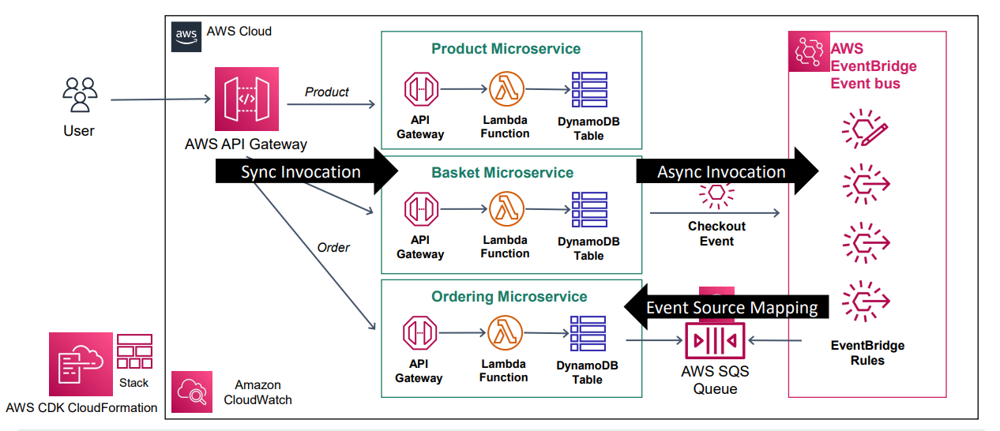

# Serverless Event-Driven E-commerce Microservices Architecture

This repository contains the implementation of a **serverless, event-driven microservices architecture** for an e-commerce application, built using AWS services and Infrastructure as Code (IaC) with AWS CloudFormation CDK.

## Architecture Overview

The system consists of the following components:
- **Product Microservice**: Manages product data and persists it in **Amazon DynamoDB**.
- **Basket Microservice**: Handles user cart operations and sends checkout events to **Amazon SQS** via **Amazon EventBridge**.
- **Order Microservice**: Polls events from **SQS** to process orders asynchronously.
- **EventBridge and SQS**: Enable decoupled and asynchronous communication between services.
- **Infrastructure as Code (IaC)**: The entire architecture is defined and deployed using **AWS CDK**.

### Architecture Diagram

## Features

- **Serverless and Scalable**: Built entirely using AWS managed services to ensure scalability and high availability.
- **Decoupled Communication**: Services communicate asynchronously using **EventBridge** and **SQS**.
- **Cost-Effective**: Pay-as-you-go model with serverless services like **AWS Lambda**.
- **Infrastructure Automation**: All resources are defined using **AWS CDK**, ensuring consistent and repeatable deployments.

## Tech Stack

- **AWS Lambda**: Serverless compute for running business logic.
- **Amazon DynamoDB**: NoSQL database for managing product data.
- **Amazon EventBridge**: Event bus for managing events between microservices.
- **Amazon SQS**: Queue service for asynchronous communication.
- **AWS API Gateway**: API layer for exposing endpoints to clients.
- **AWS CloudFormation CDK**: Infrastructure as Code for resource provisioning.
